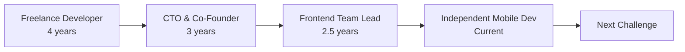

# 👋 Hi, I'm Juan Camilo

### Senior Software Engineer | Former CTO & Co-Founder | React & React Native Expert

I'm a senior software engineer with **10 years of experience** spanning freelance development, startup founding as CTO, and technical leadership. I specialize in building high-performance web and mobile applications with **React**, **React Native**, and **TypeScript**, while bringing strategic thinking and leadership from my CTO background.

Currently building cross-platform mobile apps with **React Native + Supabase** for clients while leading frontend engineering at YellowBird.

## 🚀 About Me

- 📱 Currently building **full-stack mobile apps** with React Native + Supabase for clients
- 🏢 Leading **frontend engineering** at YellowBird (React/TypeScript team)
- 👨‍💼 Former **CTO & Co-Founder** of a real estate tech startup (built team from 0 to 10 engineers)
- 💻 **10 years** building web and mobile applications across multiple domains
- 🎯 Expert in **React** (web & mobile), **React Native**, **TypeScript**, and full-stack architecture
- 🗄️ Proficient with **Supabase** (PostgreSQL, Auth, Realtime, Storage)
- 👥 Experienced in **building and leading engineering teams**
- 🌍 Remote work specialist & international collaborator
- 📚 Passionate about mentoring engineers and building great products

## 💼 Career Journey



### 🎯 Freelance Developer (2015-2019)

Built full-stack applications for clients across multiple industries. Learned to be versatile, communicate effectively with stakeholders, and deliver consistently.

### 👨‍💼 CTO & Co-Founder (2019-2022)

Co-founded a real estate tech startup where I:

- Built engineering team from ground up
- Architected entire platform from concept to production
- Made all technical decisions (stack, infrastructure, architecture)
- Worked directly with investors and board on technical strategy
- Learned to balance startup speed with engineering quality

### 💻 Frontend Team Lead (2022-Present)

Leading frontend engineering at YellowBird:

- Managing team of frontend engineers
- Driving React/TypeScript technical excellence
- Improved performance, established best practices, mentoring team members
- Hands-on coding while providing technical leadership

### 📱 Independent Mobile Developer (2023-Present)

Building full-stack mobile applications concurrently:

- Creating cross-platform apps with React Native (Expo)
- Architecting backends with Supabase (PostgreSQL, Auth, Realtime, Storage)
- Delivering complete solutions from database design to mobile UI
- Maintaining cutting-edge full-stack and mobile development skills

## 🛠️ Technical Skills

### Expert Level


### Proficient


### Specialties

- 🏗️ Frontend & Mobile Architecture
- 📱 Cross-Platform Mobile Development (iOS + Android from single codebase)
- 🗄️ Full-Stack Development (React Native + Supabase)
- ⚡ Performance Optimization (Web & Mobile)
- 👥 Technical Leadership & Team Building
- 🔧 Developer Experience & Tooling
- 🌐 Responsive & Accessible Applications
- 🧪 Testing & Quality Assurance

## 🎓 What Makes Me Different

Most senior engineers have deep technical skills. I bring that **plus**:

- **CTO Experience**: Strategic thinking about technical decisions from a business perspective
- **Active Full-Stack**: Not just past experience - currently building React Native + Supabase apps
- **Web + Mobile**: React for web, React Native for mobile - complete cross-platform capability
- **Proven Leadership**: Built engineering teams and culture from scratch
- **Full Context**: Understand the entire stack from database to mobile UI
- **Battle-Tested**: Navigated startups, scaling challenges, and leading teams through uncertainty

## 🌟 Key Strengths

```typescript
const myStrengths = {
  technical: {
    frontend: ['React (Web & Native)', 'TypeScript', 'Performance Optimization'],
    mobile: ['React Native', 'Expo', 'Cross-Platform Development', 'iOS & Android'],
    backend: ['Supabase', 'PostgreSQL', 'Authentication', 'Real-time Systems'],
    architecture: ['System Design', 'Scalability', 'Full-Stack Architecture', 'Best Practices']
  },
  leadership: {
    teamBuilding: ['Hiring', 'Mentoring', 'Culture Building'],
    strategy: ['Technical Roadmap', 'Architecture Decisions', 'Build vs Buy'],
    communication: ['Stakeholder Management', 'Technical Presentations', 'Documentation']
  },
  mindset: {
    balance: 'Business needs + Technical excellence',
    ownership: 'Full responsibility for outcomes',
    growth: 'Continuous learning and team development',
    versatility: 'Web, Mobile, Backend - complete solutions'
  }
};

export default myStrengths;
```

## 📊 Experience Highlights

```typescript
const experienceSummary = {
  yearsOfExperience: 10,
  currentFocus: ['React Native', 'React', 'TypeScript', 'Supabase'],
  currentRoles: {
    leadership: 'Frontend Team Lead @ YellowBird',
    independent: 'Building React Native + Supabase apps for clients'
  },
  highlights: {
    teamBuilt: 'X engineers (as CTO)',
    projectsDelivered: '50+ across freelance and full-time roles',
    techStack: {
      frontend: ['React', 'React Native', 'TypeScript', 'JavaScript'],
      backend: ['Supabase', 'PostgreSQL', 'Node.js'],
      mobile: ['Expo', 'iOS', 'Android']
    }
  },
  achievements: [
    'Built startup from 0 to production as CTO',
    'Leading frontend team at fast-growing startup',
    'Currently shipping mobile apps for clients',
    '10 years of continuous learning and growth'
  ]
};
```

**Note**: Most of my work is in private repositories (client work, YellowBird, startup). [Portfolio available upon request]

## 🔭 What I'm Looking For

I'm currently exploring opportunities as a **Senior Frontend Engineer**, **Senior Full-Stack Engineer**, **Senior React Native Developer**, or **Lead Engineer** where I can contribute both technical excellence and strategic thinking.

With expertise across web (React), mobile (React Native), and backend (Supabase/PostgreSQL), I can deliver value across the full stack.

**Ideal Environment**:

- 🌍 Remote-first company with strong engineering culture
- 🚀 Products that solve real problems (web, mobile, or both)
- 🎯 Teams that value both shipping and quality
- 💡 Opportunities to work across web and mobile platforms
- 📈 Growth potential and H1B sponsorship (future relocation to US)

## 📫 Let's Connect

- 💼 **Portfolio**: [juancamiloqhz.com](https://juancamiloqhz.com)
- 🔗 **LinkedIn**: [linkedin.com/in/juancamiloqhz](https://www.linkedin.com/in/juancamiloqhz)
- 📧 **Email**: [juancamiloqhz@gmail.com](mailto:juancamiloqhz@gmail.com)
- 🐦 **Twitter**: [@juancamiloqhz](https://x.com/juancamiloqhz)

---

### 💡 Fun Facts

- 🎯 I've been coding since 2015 and still love it
- 🏗️ Built a startup from 0 to production with thousands of users as CTO
- 📱 Currently building mobile apps - love that React Native lets me use React everywhere
- 🗄️ Exploring modern backend approaches with Supabase (PostgreSQL + Auth + Realtime)
- 📚 Always learning - recently diving deeper into Mobile Development and Web Performance
- 🤝 Love mentoring engineers and seeing them grow
- 🌎 Work with distributed teams across multiple time zones
- 💼 Balancing full-time leadership with hands-on client work - best of both worlds

---

**Open to opportunities** | **Available for consulting** | **Happy to mentor**

*"Great software is built by great teams. I love building both."*

<!--
**juancamiloqhz/juancamiloqhz** is a ✨ _special_ ✨ repository because its `README.md` (this file) appears on your GitHub profile.

Here are some ideas to get you started:

- 🔭 I’m currently working on ...
- 🌱 I’m currently learning ...
- 👯 I’m looking to collaborate on ...
- 🤔 I’m looking for help with ...
- 💬 Ask me about ...
- 📫 How to reach me: ...
- 😄 Pronouns: ...
- ⚡ Fun fact: ...
-->
